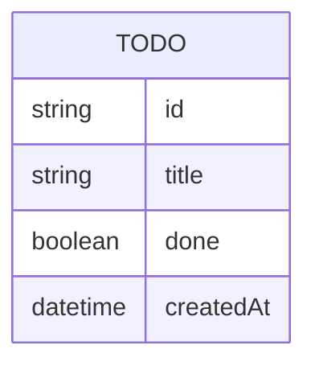

# Domain Model

A single entity, held in memory by `todo-api` for the lifetime of the process.

**Todo** — a single task. `id` is server-generated on creation. `title` is
required and non-blank. `done` defaults to `false`. `createdAt` orders the
list (oldest first) and is set once, at creation.